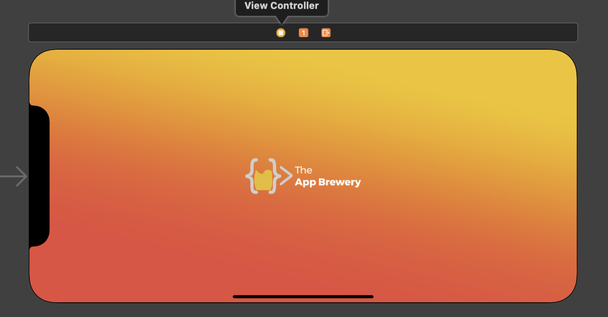

# Auto Layout 

In this Project you will get used to the idea

The source code offers the solution.

## Assigment:

- Make All the Screens rotable by adjusting:

- [ ] Make sure that the background occupies the entire screen.

Make sure that the splash screen can be seen

